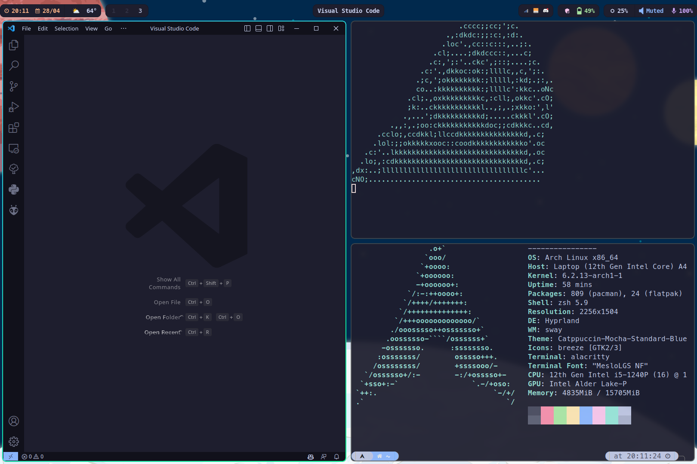

# Hyprland Config
Hyprland Tiling Window Manager Config

**Install `yay` first**

## Login Manager

- sddm-git (from AUR)

## Packages to install

```bash
yay -S hyprland-git xorg-xwayland-hidpi-xprop 	\
polkit-gnome ffmpeg neovim viewnior                       	\
rofi-lbonn-wayland-git pavucontrol thunar thunar-volman starship wl-clipboard wf-recorder 	\
swaybg grimblast-git ffmpegthumbnailer tumbler playerctl  	\
noise-suppression-for-voice thunar-archive-plugin kitty   	\
waybar-hyprland wlogout swaylock-effects sddm-git pamixer 	\
nwg-look-bin nordic-theme papirus-icon-theme dunst        	\
ttf-nerd-fonts-symbols-common otf-firamono-nerd             \
xdg-desktop-portal-hyprland xdg-desktop-portal-gtk xdg-desktop-portal \ 
swayidle nerd-fonts-meta ttf-mplus linux-headers linux-zen-headers nm-connection-editor\ 
ttf-dejavu otf-latinmodern-math noto-fonts nerd-fonts noto-fonts-cjk noto-fonts-emoji \
gvfs lxappearance kripton-theme-git polkit dbus brightnessctl bluez bluez-utils blueman\
zsh zsh-syntax-highlighting zsh-autocompletions qt5-base qt5-wayland qt6-base qt6-wayand \
btop pavucontrol wl-clipboard swaync playerctl mpv mpv-mpris wofi visual-studio-code-bin \
qt5ct qt5-styleplugins xorg-xhost alacritty wdisplays snapper snap-pac grub-btrfs python-pip\
gtk2 gtk3 gtk4 nordzy-cursors ttf-meslo-nerd-font-powerlevel10k \
gnome-keyring libsecret network-manager-applet file-roller waybar-module-pacman-updates-git \
udiskie fuse2 catppuccin-gtk-theme-mocha
```

## To-do after install
- run `pip install requests` so that the weather waybar module works
- Install flatpak
- TLP or auto-cpufreq
- CPU power gui or TLPui
- Choose a GTK theme like Kripton, Catppuccin, install it and make a copy in `~/.themes`
    - Use lxapperance to set the GTK theme
- Choose a cursor theme and install it and make a copy in ~/.icons
    - In Flatseal make an env variable and set `XCURSOR_PATH`: `XCURSOR_PATH=/home/akashg/.icons'
    - Give access to `/home/$USER/.icons` 
- To `etc/environment` add:
    - `QT_QPA_PLATFORMTHEME=qt5ct`
    - `QT_QPA_PLATFORMTHEME="qt5ct"`
- The above may work as `export` in `~/.profile`
- Use flatpak command line or Flatseal app to allow access to `~/.themes` folder to use GTK theme. May need to set `GTK_THEME` env variable to the appropriate theme folder name in `~/.themes`
- Run `xhost si:localuser:root`
- Setup btrfs using the following guide: https://www.youtube.com/watch?v=_97JOyC1o2o
- `systemctl enable bluetooth.service` and `systemctl start bluetooth.service`
- Edit `sleep-monitor.sh` and `hypr.conf` found in your `~/.config/hypr/` folder to system resolution
- install `oh-my-zsh` framework
- `systemctl enable sddm.service` and `systemctl start sddm.service` to enable sddm
- To open alacritty termimal through Thunar: find and edit file in `~/.config/thunar/uca.xml`:
    - In terminal <command> section add `alacritty –working-directory %f`

# Screenshot



# TODO
- bash script to automate all this